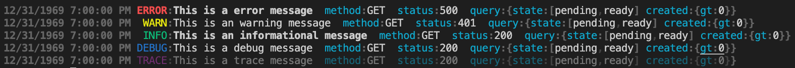

# pino-zen

Zen for Pino logging

Clean and simple colored log formatting for viewing json logs.

Example of formatting output from a http server



## Install

```sh
npm install --save-dev pino-zen
```

## Usage

When using Pino the recommended practice is to pipe the output from the main node process into a formatter. This is for performance as node is single threaded and this enables the log formatting to happen in a seperate process.

```
node main.js | pino-zen --ignore time,hostname,instance
```

### Options

- `--ignore` (`-i`): Ignore keys: (`--ignore time,hostname,instance`)
- `--first` (`-f`): Put keys at the front of the log line (`--first hostname,method`)
- `--last` (`-l`): Put keys at the back of the log line (`--last hostname,method`)
- `--theme` (`-t`): 'dark', 'light', 'none' (`--theme dark`)
- `--msg`: The key for the message (default:`msg`)
- `--level`: The key for the level (default:`level`)
- `--timestamp`: The key for the timestamp (default:`time`)
