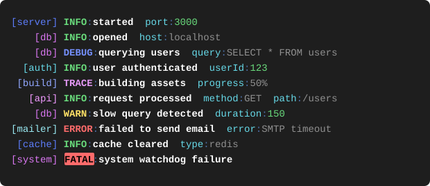

# pino-zen

Colored log formatter for [Pino](https://getpino.io) JSON logs. Works as a **Pino transport** or a **CLI pipe**.



## Install

```sh
npm install pino-zen        # project dependency
npm install -g pino-zen     # global CLI
npx pino-zen                # run without installing
```

## Pino Transport

```js
import pino from "pino"

const logger = pino({
  transport: {
    target: "pino-zen",
  },
})
```

### Multiple Targets

```js
const logger = pino({
  level: "debug",
  transport: {
    targets: [
      { target: "pino/file", options: { destination: "app.log" } },
      { target: "pino-zen" },
    ],
  },
})
```

### Custom Destination

By default the transport writes to stdout. Pass a file path or file descriptor via `destination`:

```js
{ target: "pino-zen", options: { destination: "/var/log/app.log" } }
```

## CLI

Pipe any Pino NDJSON output through the CLI:

```sh
node app.js | pino-zen
node app.js | npx pino-zen
```

| Flag | Short | Description |
|------|-------|-------------|
| `--module <field>` | `-m` | Use a field as the module prefix |

## Options

These options work with both the transport and the CLI.

### Module Mode

Prepends a color-coded, right-aligned module name to each log line. Useful for distinguishing logs from different components.

**Transport:**

```js
const logger = pino({
  transport: {
    target: "pino-zen",
    options: { module: "name" },
  },
})

logger.info({ name: "api" }, "request processed")
logger.info({ name: "auth" }, "user verified")
```

**CLI:**

```sh
node app.js | pino-zen -m name
```

**Output:**

```text
 [api] INFO request processed
[auth] INFO user verified
```

Module names are automatically color-cycled and right-aligned to the longest name seen.

### Field Suppression

Hide specific fields from output with the `formatter` option:

```js
{
  target: "pino-zen",
  options: { formatter: { pid: false, hostname: false } },
}
```

## License

MIT
